<!-- hero: scripts/build_hero.py -> assets/bsod.svg. fetch card: .github/workflows/fetch.yml refreshes assets/fetch.svg daily. -->

Hi, I'm **Purunjay**, a computer engineering student at K. J. Somaiya School of Engineering in Mumbai. I work on systems software: operating systems, compilers, databases and container runtimes, mostly in Rust and Go, plus some Python and machine learning.

I'm open to **software engineering internships** in systems, backend and infrastructure.

<pre>
reboot: Restarting system
[    0.000000] <a href="https://github.com/ChPuru/hematite">hematite</a>: x86-64 OS in Rust, boots to its own desktop
[    0.314159] <a href="https://github.com/ChPuru/Keel">keel</a>: compiled language and toolchain, no LLVM, zero deps
[  OK  ] Mounted <a href="https://github.com/ChPuru/quiver">quiver</a>: vectors, records, KV and full-text in one file
[  OK  ] Started <a href="https://github.com/ChPuru/Container">hull</a>: container engine in Go that speaks the Docker API
[  OK  ] Started <a href="https://github.com/ChPuru/vcgit">vc</a>: jj-style version control on plain git, plus a forge
[  OK  ] Started <a href="https://github.com/ChPuru/Pylon">pylon</a>: reverse proxy with hot-reloading WASM plugins
[  OK  ] Started <a href="https://github.com/ChPuru/Relay">relay</a>: API client where every request is a TOML file
[  OK  ] Started <a href="https://github.com/ChPuru/Torrent_client">btclient</a>: torrent daemon with a qBittorrent-compatible API
[  OK  ] Started <a href="https://github.com/ChPuru/Blockchain">ferrum</a>: UTXO blockchain with its own script VM
[  OK  ] Loaded <a href="https://github.com/ChPuru/NN-">scratchgrad</a>: deep learning in NumPy, every gradient by hand
[  OK  ] Loaded <a href="https://github.com/ChPuru/Scratch_LLM">tinyllm</a>: 1.7M-param language model that runs in a browser tab
[  OK  ] Started <a href="https://github.com/ChPuru/arc">arc</a>: offline voice assistant with RAG and long-term memory
[  OK  ] Started <a href="https://github.com/ChPuru/SIH26_63">kasauti</a>: deepfake forensics for Indian-language media (SIH 2026)
[  OK  ] Started <a href="https://github.com/ChPuru/Framework">filum</a>: UI framework, signals + compiled JSX, no virtual DOM
[  OK  ] Started <a href="https://github.com/ChPuru/netscape">netscape-matrix</a>: privacy browser, Tor tabs, its own search engine
[  OK  ] Started <a href="https://github.com/ChPuru/Nuctify">nuctify</a>: one player for YT Music, JioSaavn, SoundCloud and more
[  OK  ] Reached target graphical.target.

purunjay login: _
</pre>

**Contact:** <a href="mailto:ch.puru31@gmail.com"><kbd>email</kbd></a> <a href="https://www.linkedin.com/in/purunjay-choudhary"><kbd>linkedin</kbd></a>

